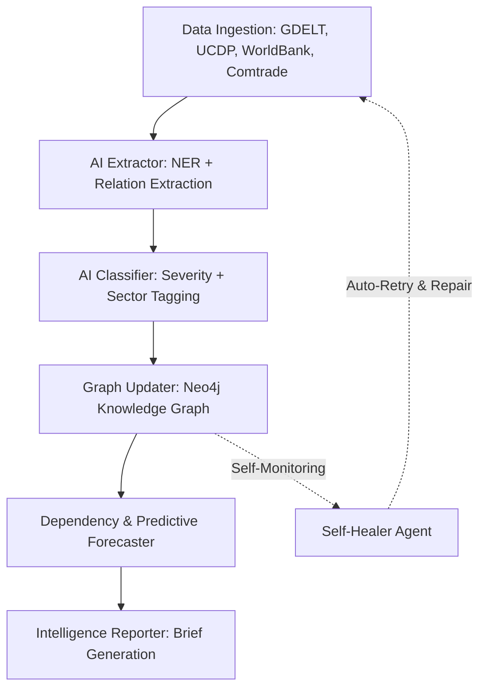

# 🌐 Sarwagya (सर्वज्ञ)
> **"All-knowing"** — A Real-Time Agentic Geopolitical Intelligence Platform.

[](https://fastapi.tiangolo.com/)
[](https://nextjs.org/)
[](https://neo4j.com/)
[](https://redis.io/)
[](https://qdrant.tech/)
[](https://supabase.com/)
[](https://airflow.apache.org/)

Sarwagya is a state-of-the-art, open-source geopolitical intelligence platform. Driven by **8 autonomous AI agents**, it aggregates raw data from multiple open data sources, constructs a real-time knowledge graph of bilateral relations, and predicts geopolitical and macroeconomic impacts.

---

## 🚀 Key Features

*   **Multi-Source Data Ingestion:** Collects from 15+ free data sources, including **GDELT**, **UCDP (Uppsala Conflict Data Program)**, **UN Comtrade**, **World Bank**, and more.
*   **Knowledge Graph (KG) Construction:** Integrates relationships dynamically in Neo4j, tracing conflicts, treaties, trade links, and diplomatic alignments.
*   **LLM & GNN Powered Analytics:** Performs named entity recognition (NER), relation extraction, and event severity classification using Llama-3 (Groq) and Gemini.
*   **Macroeconomic Impact Forecasting:** Combines structured trade dependencies and predictive analytics to forecast risks across key sectors (e.g., energy, semiconductor supply chains).
*   **Automated Intelligence Reports:** Generates structured country-brief and bilateral-brief reports dynamically.

---

## 📐 System Architecture

The platform runs an autonomous pipeline orchestrated via Apache Airflow DAGs:



---

## 🛠️ Tech Stack

| Layer | Technology | Infrastructure / Deployment |
| :--- | :--- | :--- |
| **Frontend** | Next.js 14, Tailwind CSS, shadcn/ui | Vercel |
| **Backend** | FastAPI (Python), SQLAlchemy | Render.com / Self-hosted |
| **Auth** | Supabase Auth | Managed Supabase Cloud |
| **Knowledge Graph** | Neo4j AuraDB (Cypher query language) | Neo4j Aura Cloud |
| **Vector DB** | Qdrant Client | Qdrant Cloud |
| **Cache & Queue** | Upstash Redis | Upstash Managed |
| **Pipeline Engine** | Apache Airflow | Docker-compose |
| **Orchestration** | LangGraph | Python Async |

---

## 📂 Project Directory Structure

```
sarwagya/
├── frontend/          # Next.js 14 Web Application
├── backend/           # FastAPI Backend Service
├── agents/            # Multi-Agent Ingestion & Intelligence System
├── infra/             # Production deployment templates (Docker, Airflow, Nginx)
└── docs/              # System & API Documentation
```

---

## ⚙️ Quickstart & Local Setup

### Prerequisites
*   Python 3.10+
*   Node.js 18+
*   Docker (Optional, for running Apache Airflow locally)

### Step 1: Clone the Repository
```bash
git clone https://github.com/yourname/sarwagya.git
cd sarwagya
```

### Step 2: Configure Environment Variables
Copy `.env.example` in both `backend` and `frontend` directories and populate them with your free-tier keys:

```bash
# In backend/
cp backend/.env.example backend/.env

# In frontend/
cp frontend/.env.example frontend/.env.local
```

### Step 3: Launch Backend
```bash
cd backend
python -m venv venv
# Activate virtual environment:
# On Windows:
.\venv\Scripts\Activate.ps1
# On macOS/Linux:
source venv/bin/activate

pip install -r requirements.txt
python -m uvicorn app.main:app --reload --host 127.0.0.1 --port 8002
```

### Step 4: Launch Frontend
```bash
cd ../frontend
npm install
npm run dev
```

### Step 5: Test the Data Collectors (Terminal 3)
```bash
cd ../backend
# Ensure your virtualenv is active
python agents/collector/main.py
```

---

## 🤖 Meet the AI Agents

1.  **Collector Agent:** Periodically pulls global news, trade metrics, and conflict reports.
2.  **Extractor Agent:** Leverages spaCy and Llama 3 (via Groq) to find entities (Countries, Orgs, Sectors) and extract relationships.
3.  **Classifier Agent:** Scores and categorizes geopolitical developments, ranking events by threat severity.
4.  **Graph Updater:** Connects the dots inside the Neo4j graph using transactional Cypher queries.
5.  **Dependency Analyzer:** Traces commodity dependencies and trade lanes.
6.  **Forecaster Agent:** Combines structured graph models and time-series projections to forecast future risks.
7.  **Reporter Agent:** Writes professional-grade briefings using generative LLMs.
8.  **Self-Healer Agent:** Monitors pipeline failures and retries calls automatically.

---

## 📄 License

Distributed under the MIT License. See `LICENSE` for more information.
